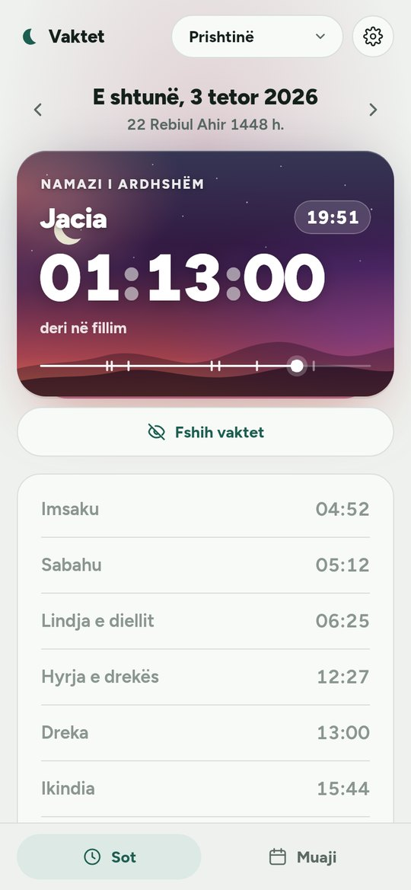
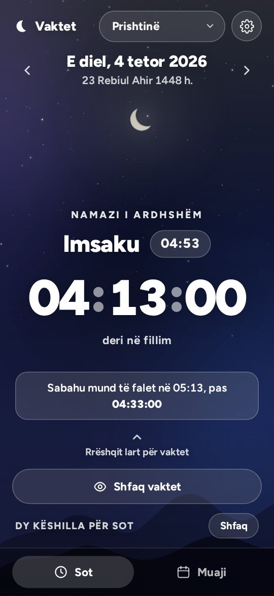
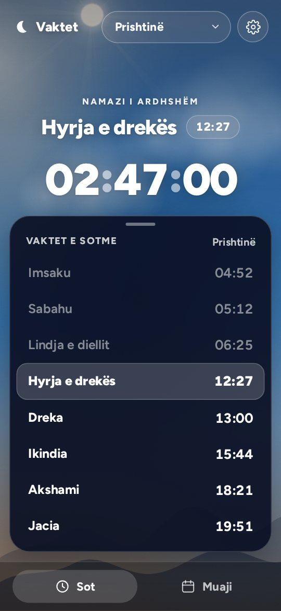
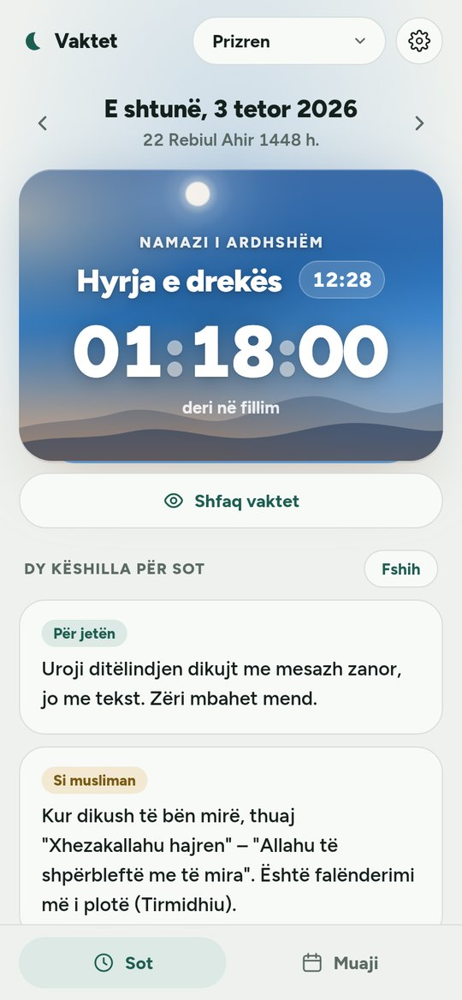
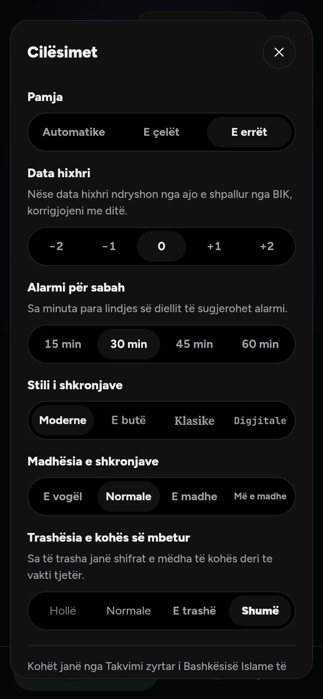

# Vaktet

### Kohët e namazit për Kosovën – të sakta, të bukura, pa reklama dhe pa internet

Kohët zyrtare nga **Takvimi i Bashkësisë Islame të Kosovës**, për 18 qytete, 
me një qiell të gjallë që ndryshon me çdo vakt.

&nbsp;

 

&nbsp;
&nbsp;
&nbsp;
&nbsp;

---

## Të reja në versionin 1.1

✨ **Qielli merr jetë** – në gjithë ekranin yje të vegjël e të butë vezullojnë lehtë, secili në ritmin e vet, herë pas here bie një yll, dielli lëshon rreze të buta që rrotullohen ngadalë, retë lundrojnë nëpër qiell gjatë ditës dhe drita e hënës merr frymë.

👆 **Rrëshqit lart për vaktet** – kur qielli mbush ekranin, rrëshqit lart dhe vaktet e sotme dalin nga poshtë; rrëshqit poshtë (ose prek qiellin, ose kthehu mbrapa) dhe fshihen përsëri.

⚡ **Më i shpejtë dhe më i butë** – qielli lëviz me ritmin e ekranit, ndërrimet mes pamjeve kalojnë butë, butonat reagojnë menjëherë nën gisht, dhe aplikacioni harxhon më pak bateri.

## Pse Vaktet?

🕌 **Kohët zyrtare të BIK-ut** – jo llogaritje të përafërta. Me dallimet e qyteteve sipas Takvimit (Prishtina −1 min, Sharri +2 min …).

⏳ **Sa minuta kanë mbetur?** – Namazi i ardhshëm dhe numërimi mbrapsht i madh shihen menjëherë, pa kërkuar nëpër tabela.

🌅 **Një qiell i gjallë** – karta merr ngjyrat e kohës: natë me yje te Jacia, agim te Sabahu, mesditë te Dreka, ar te Ikindia, muzg te Akshami. Dielli e hëna lëvizin nëpër qiell gjatë ditës; në gjithë ekranin yjet vezullojnë, bien yje, dielli lëshon rreze dhe retë lundrojnë.

⛔ **Kohët e ndaluara** – në lindje, zenit e perëndim të diellit karta bëhet e kuqe dhe të paralajmëron.

🧘 **Vetëm thelbi** – me *Fshih vaktet* mbetet vetëm koha e mbetur, me dy këshilla të reja çdo ditë (për jetën dhe si musliman). Fshihi edhe këshillat dhe qielli mbush gjithë ekranin – rrëshqit lart kur të duhen vaktet.

⏰ **Alarmi për sabah** – të sugjeron orën e alarmit 15, 30, 45 ose 60 minuta para lindjes së diellit.

📅 **Tabela e muajit** dhe **data hixhri**, me korrigjim ±2 ditë nëse shpallja e BIK-ut ndryshon.

🎨 **Si të pëlqen ty** – pamje e çelët, e errët ose automatike. Në Android zgjedh edhe stilin e shkronjave, madhësinë e tyre dhe trashësinë e numrave të kohës.

📴 **Pa internet, përgjithmonë** – të gjitha kohët janë brenda aplikacionit. Ora verore e dimërore llogaritet vetë, prandaj kohët mbeten të sakta edhe në vitet në vijim.

🔒 **Pa reklama, pa llogari, pa gjurmim** – asnjë e dhënë nuk largohet nga telefoni yt.

## Si ta marrësh

**Android**
1. Hap faqen e [versionit të fundit](https://github.com/muamerarifi-pixel/Vaktet2026/releases/latest) dhe shkarko skedarin `.apk`.
2. Hape në telefon. Nëse të pyet, lejo instalimin nga ky burim (një herë).
3. Gati – Vaktet është në ekranin kryesor.

**iPhone, laptop ose çdo pajisje tjetër**
1. Hap [vaktet-kosove-1.vercel.app](https://vaktet-kosove-1.vercel.app).
2. Nga menyja e shfletuesit zgjidh **„Shto në ekranin kryesor"** / **„Install app"**.
3. Pas hapjes së parë punon edhe pa internet.

## Qytetet

Deçan · Dragash (Sharr) · Drenas · Ferizaj · Gjakovë · Gjilan · Istog · Klinë · Malishevë · Mitrovicë · Pejë · Podujevë · Prishtinë · Prizren · Rahovec · Skënderaj · Suharekë · Vushtrri – dhe kohët bazë për gjithë Kosovën.

---

## Për zhvilluesit

### Skedarët
| Skedari | Çfarë bën |
|---|---|
| `index.html` | Faqja |
| `styles.css` | Pamja, ngjyrat e qiellit, pamja e errët |
| `app.js` | Logjika: kohët, numërimi, qielli, cilësimet |
| `data.js` | Kohët e Takvimit të BIK për çdo ditë të vitit |
| `tips.js` | Këshillat e përditshme |
| `sw.js` | Puna pa internet |
| `manifest.webmanifest` | Instalimi si aplikacion |
| `vercel.json` | Rregullat e cache-it për Vercel |
| `fonts/`, `icons/` | Shkronja Figtree (licenca OFL) dhe ikonat |

### Burimi i kohëve
Kohët janë nga Takvimi zyrtar i Bashkësisë Islame të Kosovës (BIK), 2026:
https://dituriaislame.com/wp-content/uploads/2026/01/takvimi2026vaktet.pdf

- Takvimi i BIK përsëritet sipas datës kalendarike çdo vit, prandaj tabela e ruajtur në `data.js` vlen edhe për vitet në vijim.
- Kohët ruhen në kohë standarde (UTC+1); aplikacioni shton vetë orën verore sipas zonës kohore `Europe/Belgrade` (që përdor Kosova), kështu që ndërrimi i orës mbetet i saktë në çdo vit.
- 29 shkurti (vitet e brishta) përdor kohët e 28 shkurtit.
- Dallimet e qyteteve sipas Takvimit: Prishtina, Ferizaj, Gjilani, Podujeva, Vushtrria −1 min; Sharri (Dragash) +2 min. Qytetet e tjera përdorin kohët bazë.

### Publikimi në Vercel
1. Hapni vercel.com → Add New → Project → importoni këtë repository nga GitHub.
2. Framework Preset: **Other**. Nuk ka build – është faqe statike.
3. Deploy.

Për ta provuar në kompjuter: `npx serve .` dhe hapni adresën që shfaqet.

Për ta instaluar në telefon: hapni faqen → menyja e shfletuesit → "Shto në ekranin kryesor" / "Install app".

### Aplikacioni Android (Flutter)
Dosja [`flutter_app/`](flutter_app/) e përmban këtë aplikacion të ndërtuar me Flutter, si aplikacion Android (APK). Pamja dhe sjellja janë si këtu, dhe punon pa internet.

APK ndërtohet automatikisht nga GitHub Actions (skedari `.github/workflows/android-apk.yml`): hapni **Actions → Android APK → ekzekutimin e fundit** dhe shkarkoni **vaktet-apk**. Udhëzimet e plota janë te [`flutter_app/README.md`](flutter_app/README.md).

`.vercelignore` e mban dosjen `flutter_app/` jashtë faqes në Vercel.

### Përditësimi
Nëse ndryshoni ndonjë skedar, rrisni versionin `CACHE` në `sw.js` (p.sh. `vaktet-v18`) që pajisjet ta marrin versionin e ri.
